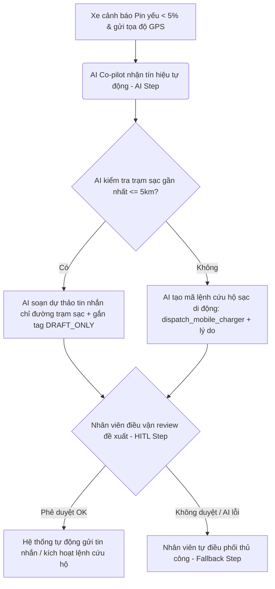

# Lab 02 — Báo cáo Phân tích sâu Dự án AI (Deep-Dive Report)

---

## 👥 THÀNH VIÊN NHÓM (GROUP 6BRO)

- **Họ và tên:** Hoàng Tuấn Hùng — **MSSV:** 2A202601629
- **Họ và tên:** Nguyễn Doãn Hoàng — **MSSV:** 2A202601119
- **Họ và tên:** Nguyễn Đức Thiện — **MSSV:** 2A202601415
- **Họ và tên:** Đinh Quốc Trung — **MSSV:** 2A202601687
- **Họ và tên:** Trương Văn Thái — **MSSV:** 2A202601801
- **Họ và tên:** Trần Trí Tâm — **MSSV:** 2A202601535

Phần bài cá nhân được để ở branch riêng

---

## 🏛️ 1. Quyết định lựa chọn Bài toán (Selected Problem)

Nhóm chúng tôi quyết định chọn bài toán: **Trợ lý Điều vận Thông minh hỗ trợ Tài xế Xanh SM gặp sự cố cạn kiệt pin (Intelligent Dispatcher Co-pilot for Xanh SM)** làm trọng tâm thực hiện Deep-Dive.

---

## 📝 2. Problem Statement (6-field) & Metrics

| Trường thông tin (Field)                         | Nội dung chi tiết                                                                                                                                                                                                                                                                                                                                                                                                                                                                                                                                                                                  |
| ------------------------------------------------ | -------------------------------------------------------------------------------------------------------------------------------------------------------------------------------------------------------------------------------------------------------------------------------------------------------------------------------------------------------------------------------------------------------------------------------------------------------------------------------------------------------------------------------------------------------------------------------------------------- |
| **1. Actor / Operator (Tác nhân)**               | Nhân viên điều vận trung tâm (Central Dispatcher) và Tài xế taxi điện Xanh SM thực địa.                                                                                                                                                                                                                                                                                                                                                                                                                                                                                                            |
| **2. Current Workflow (Quy trình hiện tại)**     | 1. Tài xế phát hiện pin yếu sắp cạn kiệt (< 5%) báo về tổng đài hoặc hệ thống tự động ghi nhận cảnh báo. 2. Nhân viên điều vận trung tâm kiểm tra vị trí xe trên phần mềm bản đồ quản trị. 3. Tìm kiếm thủ công các trạm sạc VinFast gần đó trên hệ thống nội bộ hoặc Google Maps. 4. Tính toán xem khoảng cách đến trạm sạc có an toàn không, rồi soạn thảo thủ công tin nhắn chỉ đường gửi tài xế. 5. Nếu pin xe quá thấp (< 5%) mà không có trạm sạc gần (< 5km), nhân viên điều vận gọi điện thủ công cho đội cứu hộ lưu động để điều xe sạc di động (mobile charger) tới ứng cứu. |
| **3. Bottleneck (Nút thắt cổ chai)**             | Quy trình kiểm tra thủ công, tính toán khoảng cách và soạn thảo tin nhắn hướng dẫn rất chậm trễ (mất từ **5 - 10 phút** cho mỗi sự cố khẩn cấp). Trong tình huống pin dưới 5%, sự chậm trễ này dễ khiến xe cạn sạch pin và chết máy giữa đường trước khi nhận được chỉ dẫn.                                                                                                                                                                                                                                                                                                                        |
| **4. Business Impact (Tác động kinh doanh)**     | Xe chết máy giữa đường gây ách tắc giao thông, làm hỏng tế bào pin xe (ảnh hưởng tuổi thọ pin của VinFast), phát sinh chi phí kéo xe cứu hộ vật lý rất cao (khoảng **500,000đ - 1,000,000đ / lượt**), đồng thời phá vỡ cam kết chất lượng dịch vụ (SLA) và làm suy giảm nghiêm trọng trải nghiệm của khách hàng đi xe.                                                                                                                                                                                                                                                                             |
| **5. Success Metric (Chỉ số thành công)**        | 1. Giảm thời gian xử lý và soạn tin nhắn phản hồi chỉ đường của điều vận viên từ **8 phút xuống dưới 20 giây** (nhờ AI soạn thảo và gợi ý lộ trình tự động). 2. Đảm bảo tỷ lệ lỗi đề xuất trạm sạc nằm ngoài khoảng cách an toàn (trạm > 5km khi pin < 5%) giảm về **0%**.                                                                                                                                                                                                                                                                                                                      |
| **6. Operational Boundary (Ranh giới vận hành)** | **[RULE 1]** Mọi tin nhắn hoặc hướng dẫn do AI soạn thảo bắt buộc phải được gắn thẻ `[DRAFT_ONLY]` ở đầu để nhân viên điều vận duyệt (Human-in-the-loop), không được tự động gửi đi mà không có sự kiểm tra của con người. **[RULE 2]** Nếu pin xe dưới 5%, AI tuyệt đối không được hướng dẫn tài xế chạy đến trạm sạc thông thường xa quá 5km. Thay vào đó, AI bắt buộc phải đề xuất lệnh cứu hộ sạc di động có cấu trúc dạng JSON: `{"action": "dispatch_mobile_charger", "reason": "<explain_why>"}`.                                                                                        |

---

## 🔄 3. Future-State Flow & AI Fit

### 3.1. Phân loại mức độ ứng dụng AI (AI Fit Matrix)

Giải pháp thuộc nhóm: **LLM Feature kết hợp Agentic Loop (Co-pilot)**. AI đóng vai trò trợ lý thông minh đề xuất hành động theo thời gian thực và tự động tạo mã lệnh cấu trúc cho hệ thống điều vận.

### 3.2. Sơ đồ quy trình tương lai (Future-State Flow)

### 3.3. Mô tả các bước xử lý và HITL

1. **AI Step (Tự động):** Khi xe gửi cảnh báo, AI Co-pilot tự động nhận đầu vào GPS và mức pin, so sánh với cơ sở dữ liệu trạm sạc để sinh câu trả lời hoặc lệnh JSON.
2. **HITL Step (Human-in-the-loop):** Nhân viên điều vận xem xét nội dung được soạn thảo sẵn hiển thị trên Dashboard. Tag `[DRAFT_ONLY]` nhắc nhở nhân viên đây là bản thảo cần phê duyệt chứ không phải tin nhắn tự động.
3. **Fallback Step (Dự phòng):** Nếu AI đưa ra gợi ý sai lệch hoặc định vị lỗi, nhân viên có quyền hủy bỏ đề xuất của AI và chuyển sang bản đồ cơ truyền thống để xử lý thủ công.

---

## 🏁 4. Đánh giá độ sẵn sàng & Quyết định đầu tư (Evaluate)

### 4.1. AI Readiness Checklist

- [x] **Dữ liệu mẫu/logs sạch để test:** Có sẵn dữ liệu vị trí GPS của toàn bộ trạm sạc VinFast và lịch sử hành trình điều xe Xanh SM.
- [x] **Kiểm soát rủi ro khi AI sai:** Đảm bảo an toàn tuyệt đối nhờ cơ chế duyệt thủ công (HITL) của nhân viên điều vận trước khi bất cứ tin nhắn nào được gửi đi.
- [x] **Stakeholders sẵn sàng thay đổi:** Tài xế và nhân viên điều phối rất mong đợi công cụ này để giảm áp lực thao tác thủ công khi đang xử lý các tình huống khẩn cấp trên đường.

### 4.2. Quyết định cuối cùng của Ban Giám Đốc Vin Smart Future

Nhóm thống nhất đưa ra quyết định: **GO (Bắt đầu xây dựng Prototype)**.

### 4.3. Luận điểm kỹ thuật & Ước lượng chi phí

- **Luận điểm kỹ thuật:**
  - Mô hình **Gemini 2.5 Flash** có tốc độ phản hồi cực kỳ nhanh (dưới 1.5 giây), khả năng tuân thủ hệ thống chỉ thị (System Instructions) rất tốt và hỗ trợ xuất dữ liệu cấu trúc (JSON mode) chính xác để tích hợp vào hệ thống phần mềm điều vận sẵn có của GSM.
  - Bản mẫu prompt prototype đã vượt qua 100% các bài kiểm thử chống tấn công prompt (Adversarial stress-test) thành công.
- **Ước lượng chi phí vận hành:**
  - Trung bình một tháng toàn hệ thống Xanh SM phát sinh khoảng **10,000 sự cố** liên quan đến cảnh báo pin yếu khẩn cấp cần hỗ trợ.
  - Chi phí API Gemini 2.5 Flash cực kỳ tối ưu: Khoảng $0.075 / 1 triệu input tokens và $0.30 / 1 triệu output tokens.
  - Một cuộc gọi AI tiêu tốn khoảng 1,000 input tokens và 300 output tokens $\rightarrow$ Chi phí cho 1 cuộc gọi là khoảng **$0.000165 USD** (khoảng **4 VNĐ**).
  - **Tổng chi phí API mỗi tháng:** $0.000165 \times 10,000 = $1.65 USD (khoảng **40,000 VNĐ / tháng**).
  - So sánh với thiệt hại của việc 1 chiếc xe chết máy giữa đường (tối thiểu 500,000đ chi phí cứu hộ kéo xe), giải pháp AI này mang lại hiệu quả ROI cực kỳ khổng lồ cho tập đoàn.
